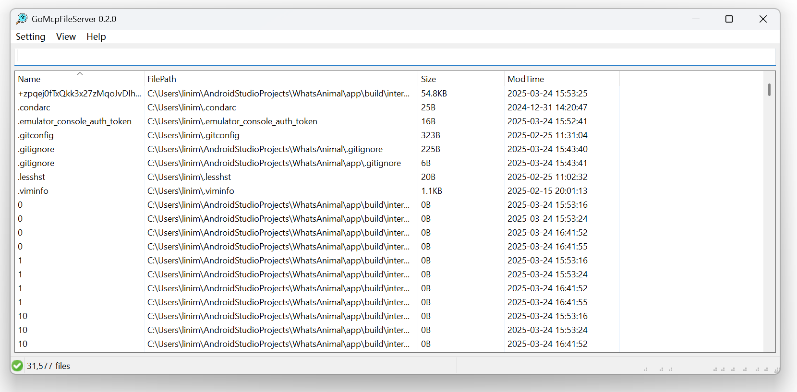
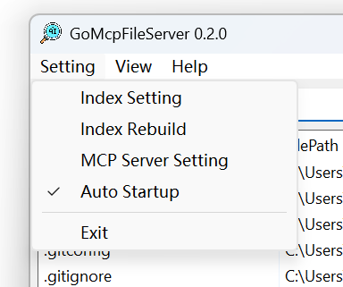
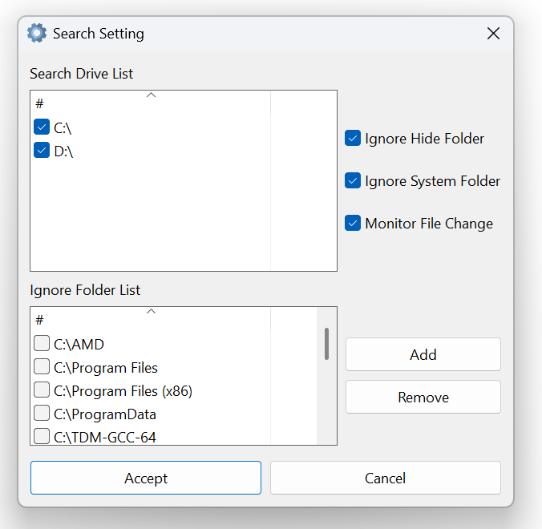
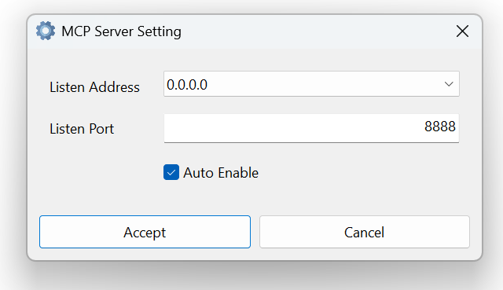
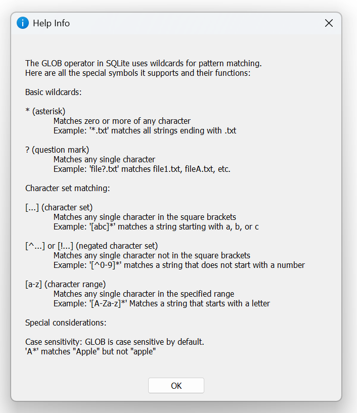

# 支持MCP文件管理软件

## 软件版本

**v0.2**

## 软件架构说明

## 一、概述

本软件基于Golang语言进行开发，旨在实现对Windows文件系统的高效管理与查询操作，并为大模型应用开发提供便利支持。软件采用walk开发框架，内置sqlite3文件搜索引擎，同时提供了mcp server的远程调用API，支持LLM大模型调用本软件的接口，具备文件索引强制同步、文件修改监听与同步以及系统自启动等功能。

## 二、技术选型

1. **编程语言**：Golang语言，以其高效的并发性能、简洁的语法和强大的标准库，为本软件的开发提供了坚实的基础。
2. **开发框架**：walk开发框架，用于构建Windows平台下的图形界面应用，提供了丰富的UI组件和事件处理机制。
3. **数据库**：内置sqlite3文件搜索引擎，作为本地文件索引和数据存储的数据库，具有轻量级、高性能和易于集成的特点。
4. **远程调用**：提供mcp server的远程调用API，支持与外部系统进行通信和数据交互。
5. **大模型支持**：支持LLM大模型调用本软件的接口，实现智能化的文件管理和查询功能。

## 三、软件架构设计

1. **分层架构**：本软件采用分层架构设计，将系统分为界面层、业务逻辑层和数据访问层。
    - **界面层**：使用walk开发框架构建Windows图形界面，负责与用户进行交互，展示文件系统信息和操作结果。
    - **业务逻辑层**：处理文件系统管理和查询的核心业务逻辑，包括文件索引的创建、更新和查询，文件修改的监听和同步等。
    - **数据访问层**：负责与内置sqlite3数据库进行交互，实现数据的存储、读取和更新操作。
2. **模块划分**：根据软件的功能需求，将系统划分为以下几个模块：
    - **文件系统管理模块**：实现对Windows文件系统的遍历、查询和操作功能，包括文件和目录的创建、删除、移动、复制等。
    - **文件索引模块**：负责创建和维护文件索引，将文件系统信息存储到sqlite3数据库中，提供高效的文件搜索功能。
    - **文件修改监听模块**：监听文件系统的文件修改事件，当文件发生变化时，自动更新文件索引和数据库中的数据。
    - **mcp server模块**：提供mcp server的远程调用API，支持外部系统通过网络调用本软件的接口，实现文件系统的远程管理和查询。
    - **LLM大模型接口模块**：实现与LLM大模型的对接，支持大模型调用本软件的接口，实现智能化的文件管理和查询功能。
    - **系统自启动模块**：实现软件的系统自启动功能，在Windows系统启动时自动运行本软件，方便用户使用。

## 四、模块功能说明

1. **文件系统管理模块**
    - 遍历Windows文件系统，获取文件和目录的详细信息。
    - 支持文件和目录的创建、删除、移动、复制等操作。
    - 提供文件和目录的属性查看和修改功能。
2. **文件索引模块**
    - 创建和维护文件索引，将文件系统信息存储到sqlite3数据库中。
    - 支持文件索引的强制同步，确保索引数据与文件系统的一致性。
    - 提供高效的文件搜索功能，支持按文件名、文件类型、文件大小、修改时间等条件进行查询。
3. **文件修改监听模块**
    - 监听文件系统的文件修改事件，包括文件的创建、删除、修改等操作。
    - 当文件发生变化时，自动更新文件索引和数据库中的数据，确保数据的实时性和准确性。
4. **mcp server模块**
    - 提供mcp server的远程调用API，支持外部系统通过网络调用本软件的接口。
    - 实现API的身份验证和权限控制，确保系统的安全性。
    - 支持数据的序列化和反序列化，实现与外部系统的数据交互。
5. **LLM大模型接口模块**
    - 实现与LLM大模型的对接，支持大模型调用本软件的接口。
    - 提供智能化的文件管理和查询功能，根据用户的输入和大模型的分析结果，实现文件的快速定位和操作。
6. **系统自启动模块**
    - 实现软件的系统自启动功能，在Windows系统启动时自动运行本软件。
    - 提供自启动设置界面，用户可以根据需要开启或关闭自启动功能。

## 五、数据流程

1. **文件索引创建流程**
    - 用户启动软件，软件遍历Windows文件系统，获取文件和目录的详细信息。
    - 软件将文件和目录信息存储到sqlite3数据库中，创建文件索引。
2. **文件查询流程**
    - 用户在软件界面输入查询条件，软件将查询条件发送到文件索引模块。
    - 文件索引模块根据查询条件在sqlite3数据库中进行查询，返回符合条件的文件和目录信息。
    - 软件将查询结果展示给用户。
3. **文件修改监听流程**
    - 文件修改监听模块监听文件系统的文件修改事件。
    - 当文件发生变化时，文件修改监听模块将文件修改信息发送到文件索引模块。
    - 文件索引模块根据文件修改信息更新sqlite3数据库中的文件索引数据。
4. **mcp server远程调用流程**
    - 外部系统通过网络调用本软件的mcp server API。
    - mcp server模块接收API请求，进行身份验证和权限控制。
    - mcp server模块将API请求转发到相应的业务逻辑模块进行处理。
    - 业务逻辑模块处理API请求，将处理结果返回给mcp server模块。
    - mcp server模块将处理结果返回给外部系统。
5. **LLM大模型调用流程**
    - 用户在软件界面输入自然语言查询或操作指令。
    - 软件将用户输入发送到LLM大模型接口模块。
    - LLM大模型接口模块将用户输入发送到LLM大模型进行分析和处理。
    - LLM大模型返回分析结果和操作建议。
    - LLM大模型接口模块根据分析结果和操作建议，调用相应的业务逻辑模块进行文件管理和查询操作。
    - 软件将操作结果展示给用户。

## 六、系统部署与运行

1. **系统部署**：本软件为Windows平台下的应用程序，可直接在Windows操作系统上运行。软件的部署环境要求如下：
    - 操作系统：Windows 7及以上版本。
    - 运行环境：Golang运行环境。
    - 数据库：sqlite3数据库。
2. **系统运行**：用户启动软件后，软件将自动加载文件索引，并进入主界面。用户可以在主界面上进行文件系统的管理和查询操作，也可以通过mcp server API或LLM大模型接口进行远程调用和智能化操作。

## 七、使用说明

### 1. **程序主界面**：

- 主界面顶部有以下菜单选项：

  - **Setting** 设置菜单，提供基本设置选项。
  - **View** 视图菜单，提供界面管理。
  - **Help** 帮助菜单，提供帮助信息。

- 界面包含一个搜索输入框。支持输入关键字搜索相应的文件信息。

- 查询表格，用于展示文件相关信息，具体如下：
  - **Name** 文件名
  - **FilePath** 文件路径
  - **Size** 文件大小
  - **ModTime** 修改时间

表格支持双击文件，即可打开相应的文件。 

### 2. **设置菜单界面**：

其界面包括如下：

- **Index Setting**：索引设置，可能用于配置文件索引相关参数，如索引存储位置、索引策略等。
- **Index Rebuild**：索引重建，用于重新构建文件索引，当文件系统有大量变动后，可通过此操作更新索引，确保搜索准确性。 
- **MCP Server Setting**：MCP服务器设置，用于配置与MCP服务器相关的参数，比如服务器地址、端口、认证信息等，保障远程调用API正常工作。 
- **Auto Startup**：自动启动，当前处于勾选状态，意味着软件会在系统启动时自动运行，方便用户随时使用。 
- **Exit**：退出选项，点击可关闭该软件。 

### 3. **文件搜索设置界面**：

用于设置文件搜索功相关参数：

#### 搜索驱动器列表（Search Drive List）

- 列出了C: 和D: 两个驱动器，均处于勾选状态 ，表示软件搜索范围包含这两个驱动器。

#### 搜索选项

- **Ignore Hide Folder**：勾选状态，意为搜索时忽略隐藏文件夹。
- **Ignore System Folder**：勾选状态，即搜索时排除系统文件夹。
- **Monitor File Change**：勾选状态，说明软件会监控文件变化，便于及时更新索引。 
- **Ignore Folder List**：忽略文件夹列表，可以自定义忽略系统相关文件夹。

#### 操作按钮

- **Accept**：点击可确认并应用上述设置。
- **Cancel**：点击则取消设置，不做任何更改。 

### 4. **MCP Server设置界面**：

用于配置MCP服务器相关参数：

- **Listen Address（监听地址）**：默认设置为 0.0.0.0 ，表示服务器将监听所有可用的网络接口，外部设备可通过对应网络访问该服务器。

- **Listen Port（监听端口）**：默认设置为 8888 ，用于指定服务器在网络中监听的端口号，客户端需通过此端口与服务器通信。 

- **Auto Enable（自动启用）**：软件启动时会自动开启MCP Server功能，无需手动操作。 

- **操作按钮**：
    - **Accept（接受）**：点击可保存并应用上述设置。
    - **Cancel（取消）**：点击则放弃设置更改，不保存新配置。 

### 4. **帮助界面**：

主要介绍SQLite中GLOB操作符用于模式匹配的通配符相关知识：

### 基本通配符

- ***(星号)**：匹配零个或多个任意字符。示例：`*.txt`匹配所有以`.txt`结尾的字符串。
- **?(问号)**：匹配任意单个字符。示例：`file?.txt`匹配`file1.txt`、`fileA.txt`等。

### 字符集匹配

- **[…]（字符集）**：匹配方括号内任意单个字符。示例：`[abc]*`匹配以`a`、`b`或`c`开头的字符串。 
- **[^…] 或 [!…]（否定字符集）**：匹配不在方括号内的任意单个字符。示例：`[^0-9]*`匹配不以数字开头的字符串 。
- **[a-z]（字符范围）**：匹配指定范围内的任意单个字符。示例：`[A-Za-z]*`匹配以字母开头的字符串。 

### 特殊注意事项

- **区分大小写**：GLOB默认区分大小写。示例：`'A*'`匹配`Apple`，但不匹配`apple` 。

## 八、总结

本软件基于Golang语言和walk开发框架，实现了对Windows文件系统的高效管理和查询操作，并提供了mcp server的远程调用API和LLM大模型的支持，为大模型应用开发提供了便利。软件采用分层架构和模块划分的设计方法，具有良好的可扩展性和可维护性。通过文件索引、文件修改监听和系统自启动等功能，提高了软件的性能和用户体验。未来，我们将不断优化软件的功能和性能，进一步完善大模型应用的支持，为用户提供更加便捷和智能化的文件管理服务。 
